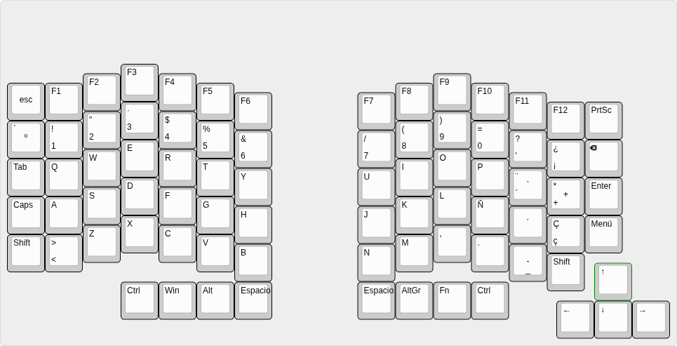

# Mykeyboard — Split Ergo Keyboard

Teclado ergonómico split de diseño propio. Proyecto de hardware abierto: esquemáticos y PCB en KiCad, firmware en QMK, y carcasa imprimible en 3D.

## Layout

Split columnar-stagger ISO-ES (español completo: Ñ, Ç, ‡, ¡, ¿), ~38 teclas por mitad, espacio dividido y flechas dedicadas.



## Estado

En desarrollo. Estructura del proyecto montada, KiCad 10.0.6 instalado, requisitos y layout definidos.

## Estructura del proyecto

```
Mykeyboard/
├── hardware/          # Diseño electrónico (KiCad)
│   ├── left/          # Mitad izquierda (esquemático + PCB)
│   ├── right/         # Mitad derecha (espejo de la izquierda)
│   └── shared/        # Librerías, símbolos, footprints y plantillas comunes
├── firmware/          # Firmware del teclado (QMK)
├── case/              # Carcasa imprimible en 3D (STL / FreeCAD)
├── docs/              # Documentación: requisitos, layout, BOM, decisiones
├── tools/             # Scripts de utilidad (generación, automatización)
└── README.md
```

## Hardware

- **KiCad**: 10.0.6 (esquemático y PCB).
- **Layout**: split columnar-stagger ISO-ES, ~37-38 teclas por mitad, placa única que se parte en dos (V-cut/mouse bites).
- **Controlador**: RP2040-Zero por mitad, conectadas por TRRS.
- **Switches**: Outemu Silent Lemon V3 (táctiles silenciosos), soldados.
- **Pantalla**: OLED 128x32 (I2C) en la mitad master.
- **Extras**: encoder rotatorio EC11 (volumen/medios), hub USB (puerto ratón/pendrive) en la mitad master.
- Ver [docs/requirements.md](docs/requirements.md), [docs/layout.md](docs/layout.md) y el [BOM](docs/bom.md).

## Firmware

QMK (cableado).

## Cómo contribuir / desarrollo

1. Clona el repositorio.
2. Abre los proyectos de KiCad en `hardware/left` y `hardware/right`.
3. Documenta cualquier cambio relevante en `docs/`.

## Licencia

Pendiente de decidir (recomendado: CERN-OHL-S para hardware, MIT para firmware).
